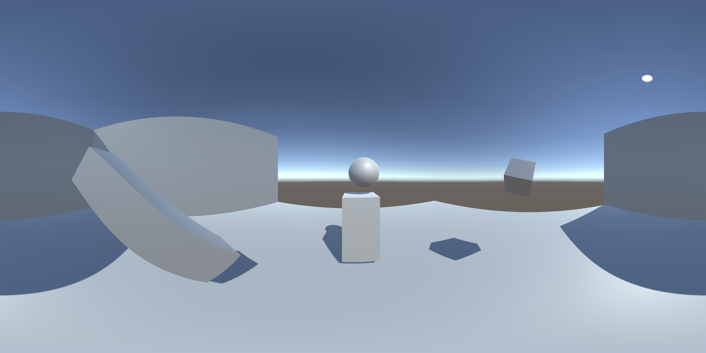

# Unity 360° Screenshot Capture

**Available on Asset Store:** https://www.assetstore.unity3d.com/en/#!/content/112864

**Forum Thread:** https://forum.unity.com/threads/360-screenshot-capture-open-source.501310/

This simple script captures a **360° photo** with your Unity camera and injects the necessary **XMP metadata** to it; so the output image supports 360° viewers on the web out-of-the-box (like *Facebook* and *Flickr*). Both **JPEG** and **PNG** formats are supported.

The raw image is in equirectangular form. Here is an example screenshot [(it looks like this when uploaded to Flickr)](https://flic.kr/p/VPxPwY):



## How to Use
Simply call the `I360Render.Capture()` function. Its signature is as following:

```csharp
public static byte[] Capture( int width = 1024, bool encodeAsJPEG = true, Camera renderCam = null );
```

- **width**: The width of the resulting image. It must be a power of 2. The height will be equal to *width / 2*. Be aware that maximum allowed image width is 8192 pixels
- **encodeAsJPEG**: determines whether the image will be encoded as *JPEG* or *PNG*
- **renderCam**: the camera that will be used to render the 360° image. If set to null, *Camera.main* will be used

The function returns a **byte[]** object that you can write to a file using `File.WriteAllBytes` (see example code below).

## Example Code

```csharp
using System.IO;
using UnityEngine;

public class RenderTest : MonoBehaviour
{
	public int imageWidth = 1024;
	public bool saveAsJPEG = true;

	void Update()
	{
		if( Input.GetKeyDown( KeyCode.P ) )
		{
			byte[] bytes = I360Render.Capture( imageWidth, saveAsJPEG );
			if( bytes != null )
			{
				string path = Path.Combine( Application.persistentDataPath, "360render" + ( saveAsJPEG ? ".jpeg" : ".png" ) );
				File.WriteAllBytes( path, bytes );
				Debug.Log( "360 render saved to " + path );
			}
		}
	}
}
```
